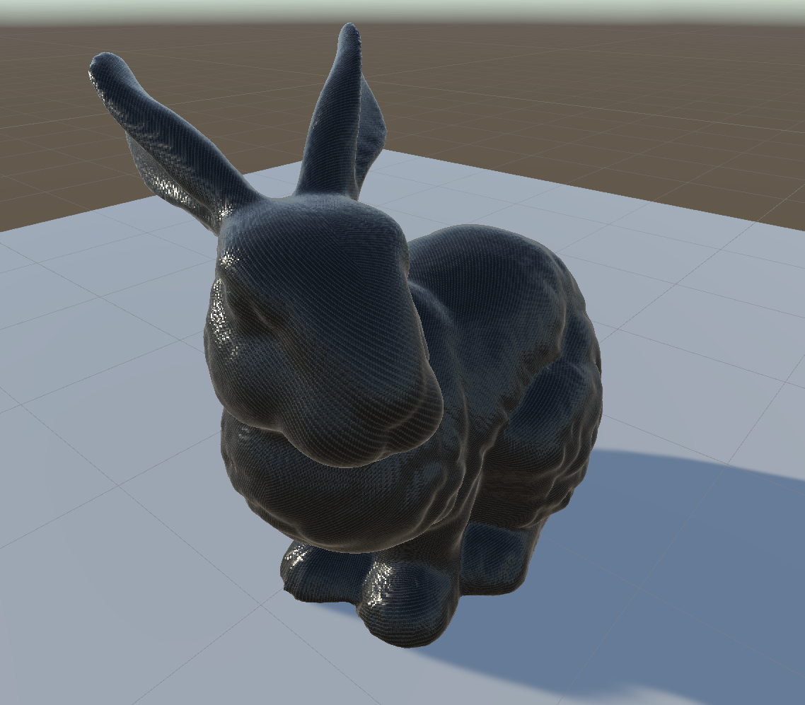

# UnityGenerativeCarbonFiber

Generative Carbon Fiber Shader for Unity

I'll put something here eventually

## Contact / Support

If you find an issue / bug, have a feature request or have a question, create an issue on this repo.
Support isn't guaranteed, but its the best way to get into contact with me.

*If you enjoy this project, support my work by simply starring this repo! Thanks Spartan!*

## Acknowledgements

- Carbon Fiber Design based on [CG Masters Blender Tutorial](https://www.youtube.com/watch?v=1qh2J4oQzy0)
- Clear Coat Functions Developed by [Hax Flying](https://github.com/haxflying/Unity-SimpleClearCoat/tree/master/Assets/Shaders)